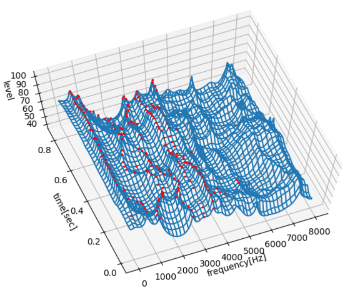
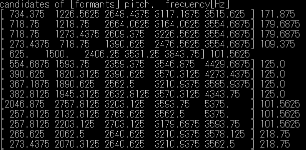

# 音声のホルマントの３Ｄ表示  

## 概要  

LPC(線形予測分析)法によるホルマント周波数とピッチ周波数を推定する簡略的なプログラム。  
LPCスペクトルと推定されたホルマントの位置を3D表示する。  

[github repository](https://github.com/shun60s/Formant)  

## 使い方

wavファイル(16khz,mono,16bit)名前を引数にして実行する。   
```
python main1.py wav/aiueo1.wav
```
aiueo1.wav「あいうえお」の推定で結果である。  
下図のようにスペクトルと、ホルマントの候補位置が赤丸で表示される。  
  
  
  
  
また、下図のように、ホルマント周波数の5番目までの[候補]とピッチ周波数の推定値が表示される。 
注意：これらの値は正しいとは限らない。外れていることもある。  
  


## 参照したもの  

- [線形予測分析](http://aidiary.hatenablog.com/entry/20120415/1334458954)  
- [日本語音声サンプル](http://www.gavo.t.u-tokyo.ac.jp/~mine/B3enshu2001/samples.html)  


## 免責事項  
THE SOFTWARE IS PROVIDED "AS IS", WITHOUT WARRANTY OF ANY KIND, EXPRESS OR IMPLIED, 
INCLUDING BUT NOT LIMITED TO THE WARRANTIES OF MERCHANTABILITY, FITNESS 
FOR A PARTICULAR PURPOSE AND NONINFRINGEMENT. IN NO EVENT SHALL 
THE AUTHORS OR COPYRIGHT HOLDERS BE LIABLE FOR ANY CLAIM, DAMAGES OR OTHER LIABILITY, 
WHETHER IN AN ACTION OF CONTRACT, TORT OR OTHERWISE, ARISING FROM, 
OUT OF OR IN CONNECTION WITH THE SOFTWARE OR THE USE OR OTHER DEALINGS IN THE SOFTWARE.  
#### 上記はMITライセンスからの抜粋です。


